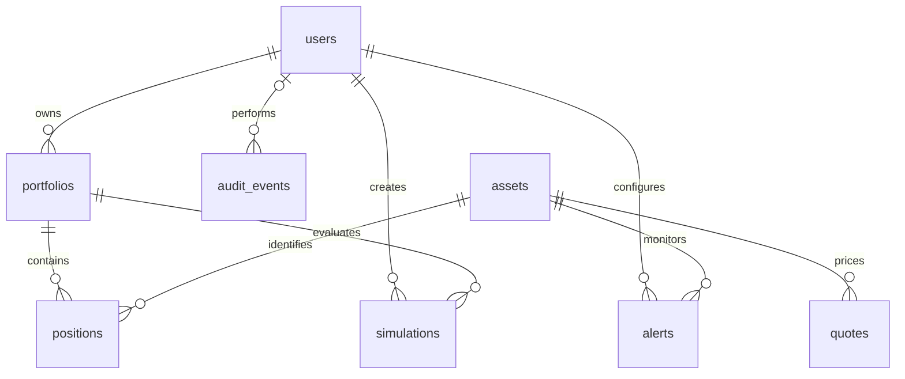

# Modelo relacional

Claves primarias UUID representadas como cadenas de 36 caracteres; valores monetarios
y cantidades en `NUMERIC(24,8)`, fechas UTC con zona horaria. PostgreSQL es la base de ejecución.

| Tabla | Clave y relaciones | Restricciones |
|---|---|---|
| users | PK id | email único, rol Analista/Gerente/Administrador, hash Argon2, estado activo |
| portfolios | PK id, FK owner_id → users | nombre único por propietario |
| assets | PK id | símbolo único, nombre, tipo y moneda |
| positions | PK compuesta portfolio_id + asset_id | FK a portafolio y activo; cantidad y costo no negativos |
| quotes | PK id, FK asset_id → assets | valor positivo; único por activo, fecha y fuente |
| alerts | PK id, FK user_id y asset_id | umbral positivo, dirección above/below |
| simulations | PK id, FK portfolio_id y created_by | parámetros JSON, resultado JSON opcional |
| audit_events | PK id, FK user_id opcional | acción, fecha y detalles sin contraseñas ni tokens |

Las claves foráneas preservan referencias. Borrar un portafolio elimina sus posiciones
en cascada; las demás relaciones impiden eliminar filas aún referenciadas.
Hay índices sobre correo, claves foráneas y fechas de consulta/auditoría.
Los roles se almacenan como `analista`, `gerente`, `administrador` y se exponen con su
nombre en español. El seed crea tres usuarios, tres portafolios y el activo NDX.

Este sprint define el esquema de portafolios, alertas y simulaciones; sus operaciones
de negocio pertenecen a historias posteriores. El endpoint de cotizaciones usa Redis
como caché temporal; la tabla quotes queda preparada para persistencia histórica.
